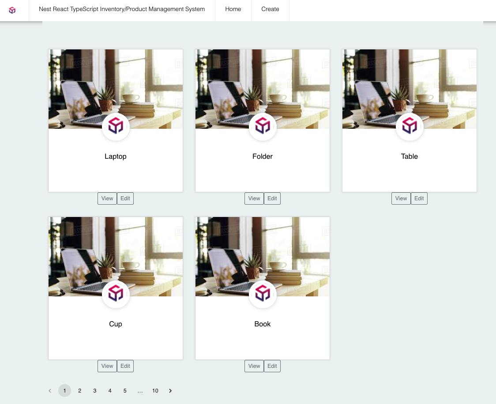

# Overview

This is a sample product/inventory management system that has:
- CRUD capability
- Pagination, filtering, searching (via GraphQL)
- Auth & Guard implementation

## Tech stack

- Backend: 
  <br>- Nest.JS/Typescript with Auth & Guards implemented
  <br>- Uses Apollo GraphQL (note: RESTful is currently not enabled)
- Frontend: 
  <br>- React.js

<br>

# Setup

## Pre-requisites
- NodeJS Version 16+
- Local mongodb community version [5.0.4](https://www.mongodb.com/try/download/community) is installed on computer
<br> Also, ensure that mongod instances are started. If not, run:
```bash
$ brew services start mongodb-community@5.0
```

## First-time setup
```bash
$ git clone https://github.com/wbwht/inventorysystem.git
```

<br>

# 1. Run ims-backend
```bash
$ cd ims-backend/
$ npm install
```

Add a new .env file to ims-backend root directory and add the following line:
```bash
APP_SECRET=<YOUR_PASSWORD>
```

Once done, run the application with:
```bash
$ npm run start:dev
```

## GraphQL
Go to http://localhost:5000/graphql to run GraphQL queries
(Note: RESTful API is not enabled0)

### 1. Example GraphQL query to get a page of items (first page of 2 items)
```bash
query getallproducts_withpage($pagefilters: ListProductInput) {
  products (filters: $pagefilters){
    _id
    category
    date_posted
    description
    title
  }
}
```
With query variables set as follows:
```bash
{
  "pagefilters": {
    "skip": 0,
    "limit": 2
  }
}
```

### 2. Example GraphQL query to search
```bash
query search($searchFilter : ListProductInput) {
  products (filters: $searchFilter){
    _id
    category
    date_posted
    description
    title
  }
}
```
With query variables set as follows (eg. it will list all items with "furniture"):
```bash
{
  "searchFilter": {
    "search": "furniture"
  }
}
```

### 3. Example GraphQL query to filter based on category of products
```bash
query categoryFilter($categoryFilter : ListProductInput) {
  products (filters: $categoryFilter){
    _id
    category
    date_posted
    description
    title
  }
}
```
With query variables set as follows (eg. it will display all items with "Stationery" category):
```bash
{
  "categoryFilter": {
    "category": "Stationery"
  }
}
```
<br>

# 2. Run ims-frontend

Ensure that yarn is already installed. If not, run:
```bash
$ npm install -g yarn
```

Run installation as follows:

```bash
$ cd ims-frontend/
$ yarn
$ yarn start
```

Expected outcome if everything works well:



<br>

# Others

## To-do

- [ ] Connect frontend to backend to implement pagination
- [ ] Connect frontend to backend to implement filtering
- [ ] Connect frontend to backend to implement searching
- [ ] Complete E2E and unit testing

## References

